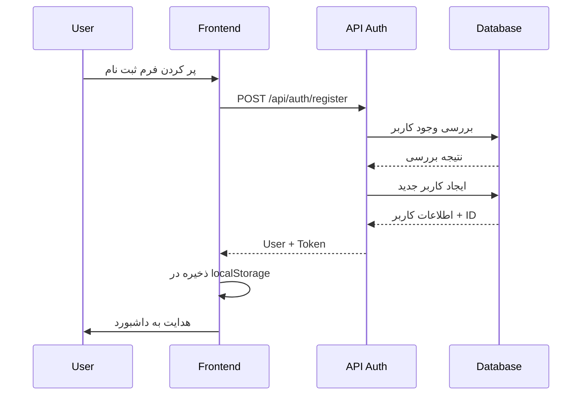
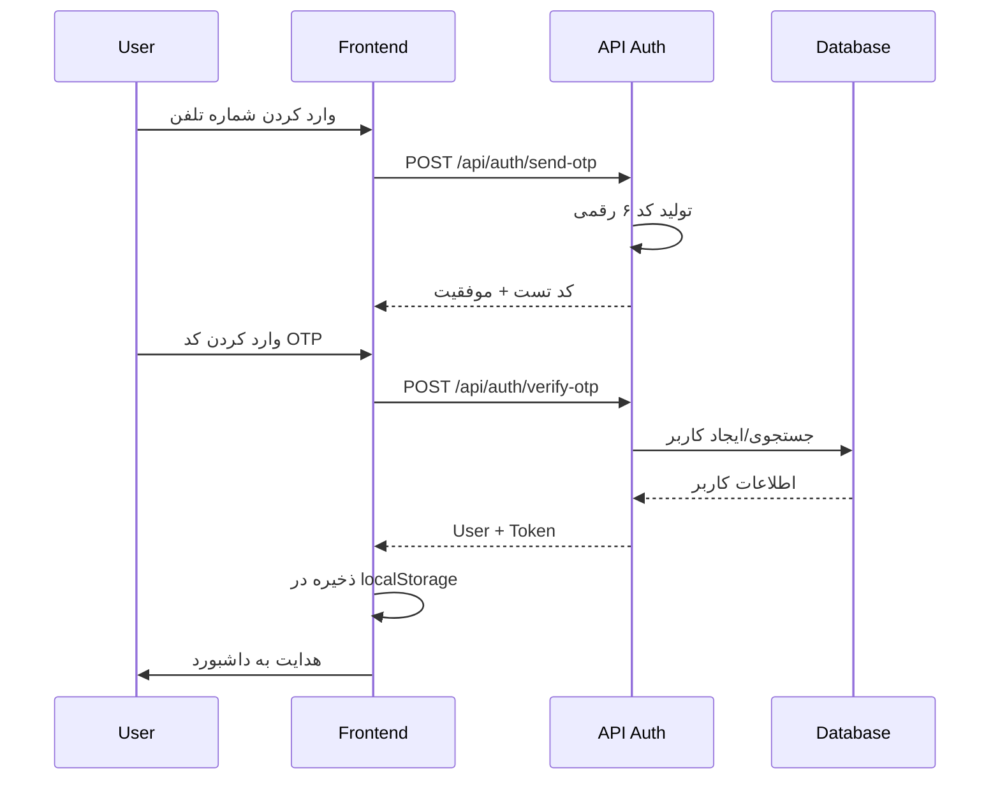

# مستندات فنی پروژه آکادمی فنیار

## 🏗️ معماری پروژه

### ساختار کلی
پروژه بر اساس **Next.js 15** با **App Router** طراحی شده است و از معماری زیر پیروی می‌کند:

```
┌─────────────────────────────────────────────────────────────┐
│                    Client Side (Browser)                    │
├─────────────────────────────────────────────────────────────┤
│  React Components │ State Management │ UI/UX               │
│  - Pages          │ - useState       │ - Tailwind CSS      │
│  - Components     │ - useEffect      │ - shadcn/ui         │
│  - Hooks          │ - Context        │ - Framer Motion     │
├─────────────────────────────────────────────────────────────┤
│                    Next.js App Router                       │
├─────────────────────────────────────────────────────────────┤
│  API Routes │ Middleware │ Server Components               │
│  - Auth     │ - CORS     │ - Data Fetching                 │
│  - CRUD     │ - Security │ - Server Actions                │
├─────────────────────────────────────────────────────────────┤
│                    Data Layer                               │
├─────────────────────────────────────────────────────────────┤
│  Prisma ORM │ SQLite DB │ Socket.IO │ File System          │
│  - Schema    │ - Queries │ - Real-time│ - Static Assets     │
└─────────────────────────────────────────────────────────────┘
```

## 🔧 جزئیات پیاده‌سازی

### ۱. احراز هویت (Authentication)

#### جریان ثبت نام:


#### جریان ورود با OTP:


### ۲. مدیریت حالت (State Management)

#### ساختار حالت در کلاینت:
```typescript
// Local State در کامپوننت‌ها
const [user, setUser] = useState<User | null>(null)
const [courses, setCourses] = useState<Course[]>([])
const [loading, setLoading] = useState(false)

// Persistent State در localStorage
const userData = localStorage.getItem('user')
const token = localStorage.getItem('token')
```

### ۳. لایه دیتابیس

#### مدل‌های Prisma:
```prisma
model User {
  id        String   @id @default(cuid())
  phone     String   @unique
  name      String?
  email     String?
  avatar    String?
  isActive  Boolean  @default(true)
  createdAt DateTime @default(now())
  updatedAt DateTime @updatedAt
  
  enrollments Enrollment[]
}

model Course {
  id          String   @id @default(cuid())
  title       String
  description String
  content     String
  imageUrl    String?
  price       Float
  duration    Int
  level       Level
  categoryId  String
  teacherId   String
  isActive    Boolean  @default(true)
  createdAt   DateTime @default(now())
  updatedAt   DateTime @updatedAt
  
  category    Category @relation(fields: [categoryId], references: [id])
  teacher     Teacher  @relation(fields: [teacherId], references: [id])
  enrollments Enrollment[]
}

model Enrollment {
  id         String      @id @default(cuid())
  userId     String
  courseId   String
  status     EnrollmentStatus @default(ACTIVE)
  progress   Float       @default(0)
  enrolledAt DateTime    @default(now())
  updatedAt   DateTime    @updatedAt
  
  user       User        @relation(fields: [userId], references: [id])
  course     Course      @relation(fields: [courseId], references: [id])
  
  @@unique([userId, courseId])
}
```

### ۴. API Routes

#### ساختار API:
```typescript
// /api/auth/register/route.ts
export async function POST(request: NextRequest) {
  try {
    const { phone, name, email } = await request.json()
    
    // Validation
    if (!phone || !name) {
      return NextResponse.json({ error: '...' }, { status: 400 })
    }
    
    // Business Logic
    const existingUser = await db.user.findUnique({ where: { phone } })
    if (existingUser) {
      return NextResponse.json({ error: '...' }, { status: 400 })
    }
    
    const user = await db.user.create({ data: { phone, name, email } })
    
    // Response
    return NextResponse.json({
      user: { id: user.id, phone: user.phone, name: user.name },
      token: 'registered-user-token-' + user.id
    })
  } catch (error) {
    return NextResponse.json({ error: '...' }, { status: 500 })
  }
}
```

### ۵. کامپوننت‌های اصلی

#### ساختار کامپوننت‌ها:
```typescript
// Header Component
interface HeaderProps {
  user?: User | null
}

export function Header({ user }: HeaderProps) {
  const [isMenuOpen, setIsMenuOpen] = useState(false)
  
  return (
    <nav className="bg-white shadow-sm sticky top-0 z-50">
      {/* Desktop Navigation */}
      <div className="hidden md:block">
        <div className="flex items-center justify-center space-x-8">
          <NavigationItem icon={Home} label="خانه" href="#home" />
          <NavigationItem icon={BookOpen} label="دوره‌ها" href="#courses" />
          {/* ... */}
        </div>
      </div>
      
      {/* Mobile Navigation */}
      <div className="md:hidden">
        <HamburgerMenu isOpen={isMenuOpen} onToggle={setIsMenuOpen} />
      </div>
    </nav>
  )
}
```

### ۶. مدیریت فرم‌ها

#### اعتبارسنجی فرم‌ها:
```typescript
// Login Form Validation
const validatePhone = (phone: string): boolean => {
  const phoneRegex = /^09[0-9]{9}$/
  return phoneRegex.test(phone)
}

const validateOTP = (otp: string): boolean => {
  const otpRegex = /^[0-9]{6}$/
  return otpRegex.test(otp)
}

// Form Submission
const handleSubmit = async (e: React.FormEvent) => {
  e.preventDefault()
  
  if (!validatePhone(phone)) {
    setError('شماره تلفن نامعتبر است')
    return
  }
  
  setLoading(true)
  try {
    const response = await fetch('/api/auth/send-otp', {
      method: 'POST',
      headers: { 'Content-Type': 'application/json' },
      body: JSON.stringify({ phone })
    })
    
    const data = await response.json()
    if (response.ok) {
      setShowOTP(true)
      setSuccess(`کد تایید ارسال شد: ${data.otp}`)
    }
  } catch (error) {
    setError('خطا در ارتباط با سرور')
  } finally {
    setLoading(false)
  }
}
```

### ۷. ریسپانسیوسیتی

#### استراتژی ریسپانسیوسیتی:
```css
/* Mobile First Approach */
.container {
  @apply max-w-7xl mx-auto px-4;
}

/* Mobile (default) */
.grid {
  @apply grid-cols-1 gap-4;
}

/* Tablet */
@media (min-width: 768px) {
  .grid {
    @apply grid-cols-2 gap-6;
  }
}

/* Desktop */
@media (min-width: 1024px) {
  .grid {
    @apply grid-cols-3 gap-8;
  }
}
```

### ۸. بهینه‌سازی عملکرد

#### تکنیک‌های بهینه‌سازی:
```typescript
// 1. Lazy Loading Components
const Dashboard = dynamic(() => import('./dashboard'), {
  loading: () => <div>Loading...</div>
})

// 2. Image Optimization
<Image
  src={course.imageUrl}
  alt={course.title}
  width={400}
  height={300}
  className="rounded-lg"
  priority={index < 3}
/>

// 3. Data Fetching with Caching
const fetchCourses = async () => {
  const response = await fetch('/api/courses', {
    next: { revalidate: 3600 } // 1 hour cache
  })
  return response.json()
}

// 4. Memoization
const CourseCard = memo(({ course }: { course: Course }) => {
  return (
    <Card>
      {/* Card content */}
    </Card>
  )
})
```

### ۹. امنیت

#### تدابیر امنیتی:
```typescript
// 1. Input Sanitization
const sanitizeInput = (input: string): string => {
  return input.trim().replace(/[<>]/g, '')
}

// 2. Token Validation
const validateToken = (token: string): boolean => {
  try {
    const decoded = Buffer.from(token, 'base64').toString()
    const [userId, timestamp] = decoded.split(':')
    
    // Check if token is not expired (24 hours)
    const isExpired = Date.now() - parseInt(timestamp) > 24 * 60 * 60 * 1000
    return !isExpired
  } catch {
    return false
  }
}

// 3. Rate Limiting (مفهومی)
const rateLimiter = new Map<string, number>()

const checkRateLimit = (ip: string): boolean => {
  const requests = rateLimiter.get(ip) || 0
  if (requests > 100) return false
  
  rateLimiter.set(ip, requests + 1)
  setTimeout(() => rateLimiter.delete(ip), 60000) // 1 minute
  return true
}
```

### ۱۰. مدیریت خطا

#### استراتژی مدیریت خطا:
```typescript
// Error Boundary Component
class ErrorBoundary extends Component {
  constructor(props) {
    super(props)
    this.state = { hasError: false }
  }

  static getDerivedStateFromError(error) {
    return { hasError: true }
  }

  componentDidCatch(error, errorInfo) {
    console.error('Error caught by boundary:', error, errorInfo)
  }

  render() {
    if (this.state.hasError) {
      return <ErrorFallback />
    }
    return this.props.children
  }
}

// Global Error Handler
const handleGlobalError = (error: Error) => {
  console.error('Global error:', error)
  // Send to error tracking service
}
```

## 🔄 جریان داده‌ها

### ۱. جریان کاربر:
```
Login/Register → Token Generation → Local Storage → Dashboard → API Calls
```

### ۲. جریان دوره‌ها:
```
API Request → Database Query → Response → Component State → UI Render
```

### ۳. جریان ثبت نام:
```
Course Selection → API Request → Database Insert → Success Message → UI Update
```

## 📊 مانیتورینگ و دیباگ

### ۱. Console Logging:
```typescript
// Development Logging
if (process.env.NODE_ENV === 'development') {
  console.log('Debug info:', data)
}

// Error Logging
console.error('API Error:', error)
```

### ۲. Performance Monitoring:
```typescript
// Component Render Time
const startTime = performance.now()
// ... component logic
const endTime = performance.now()
console.log(`Component render took ${endTime - startTime} milliseconds`)
```

## 🚀 استقرار و تولید

### ۱. Environment Variables:
```bash
# .env.local
DATABASE_URL="file:./db/custom.db"
NEXTAUTH_SECRET="your-secret-key"
NEXTAUTH_URL="http://localhost:3000"
```

### ۲. Build Process:
```bash
# Development
npm run dev

# Production Build
npm run build
npm run start
```

### ۳. Docker Configuration:
```dockerfile
FROM node:18-alpine AS base
WORKDIR /app
COPY package*.json ./
RUN npm ci --only=production

FROM base AS builder
COPY . .
RUN npm run build

FROM base AS runner
COPY --from=builder /app/.next ./.next
COPY --from=builder /app/public ./public
EXPOSE 3000
CMD ["npm", "start"]
```

---

**توسعه‌دهنده: امین وندی**  
**آخرین به‌روزرسانی: ۲۰۲۴**